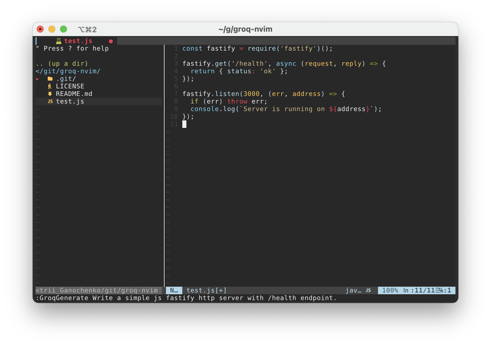

# groq-nvim

Neovim Plugin to provide code assistance with Groq. Inspired by [cdreetz/groq-nvim](https://github.com/cdreetz/groq-nvim).



## Installation

Get Groq API key [here](https://console.groq.com/keys).

### Using [lazy.nvim](https://github.com/folke/lazy.nvim)

```lua
  {
    "ganochenkodg/groq-nvim",
    config = function()
      require('groq-nvim').setup({
        api_key = "your_groq_api_key",
        model = "llama3-70b-8192"
      })
    end
  }
```

### Using [vim-plug](https://github.com/junegunn/vim-plug)

```
call plug#begin('~/.vim/plugged')
  Plug 'nvim-lua/plenary.nvim'
  Plug 'ganochenkodg/groq-nvim'
call plug#end()

lua << EOF
  require('groq-nvim').setup({
    api_key = "your_groq_api_key",
    model = "llama3-70b-8192"
  })
EOF
```

You can find a list of available models [here](https://console.groq.com/docs/models).

## Commands

These are the current available commands

```
- :GroqGenerate

- :GroqGenerateWithContext

- :GroqEdit

- :GroqOptimize
```

To use GroqGenerate, all you do is :GroqGenerate your prompt and the code will be generated at the place of the cursor

To use GroqGenerateWithContext, you start with :GroqGenerateWithContext your prompt /path/to/context/file.py 

To use GroqEdit, select some text and run :GroqEdit your prompt, or use :5,10GroqEdit your prompt. The selected code will be rewritten based on your prompt

To use GroqOptimize, select some text and run :GroqOptimize, or run :5,10GroqOptimize. The selected code will be cleaned and optimized.

